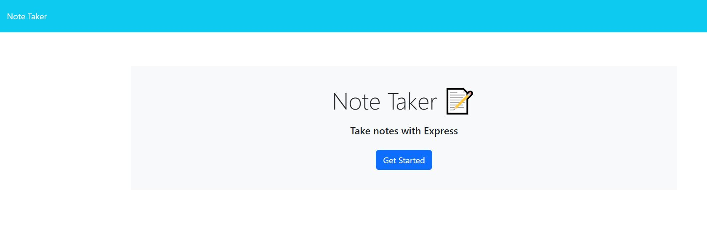
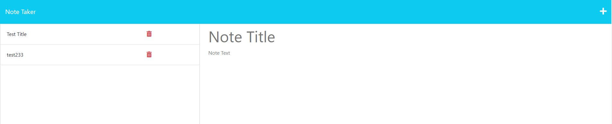

# Note Taker
  ## Description
   My motivation behind creating this note taker app was to make task handling more organised and manageable. Users can add a new task by clicking on the "+" sign on the upper right side. Two text fields are provided, one for title and other for task description, once both text fields are populated, click on the save button and the task will be saved on the left side. Delete functionality is provided as well, to delete a particular task. Users can also click on one of the tasks displayed on the left side and task detail along with task title will be displayed on the right side. This app is deployed on heroku

  ## Heroku App link: 
   https://vast-tundra-45112-80cd8ed984a3.herokuapp.com/

 

  ## Picture of the app
  
  
  

  ## Table of Content

  - [Installation](#installation)
  - [Usage](#usage)
  - [Contribution Details](#contribution-details)
  - [Test Instructions](#test-instructions) 
  - [License](#licenses)
  - [Contact](#contact)
  
  

  ## Installation: 
  Node.js, fs and uuid packages, express.js

  ## Usage:
  to orgamize the tasks (create, save delete)

  ## Contribution Details: 
   Neha Sabannavar, Rutgers TA, Xpert Learning Assistant, AskBCS

  ## Test Instructions: 
  None

  ## Licenses: 
  MIT
      
  https://opensource.org/licenses/MIT 

  
  ## Contact: 
  Below mentioned is my github profile link

  ## Github: https://github.com/nehaps29

